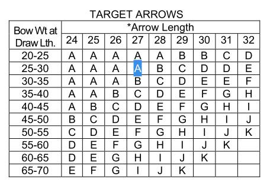

# Klasszikus vesszőméretezés, részletek fordítása

Klasszikus vesszőméretezés

Forrásdokumentum: [AMO Standard (PDF)](http://www.outlab.it/doc/amostd.pdf)

---

## AMO HAGYOMÁNYOS ÍJHOSSZ STANDARD

[cite_start]Az AMO íjhossz-standard három hüvelykkel hosszabb, mint az AMO mester-ideg, amely a megfelelő ideg- vagy aljzásmagasságot állítja be az íjon[cite: 8]. [cite_start]Az mester-ideg csak az íjhossz megjelölését viseli[cite: 9]. 

> [cite_start]**Példa:** Egy AMO 66" (íjhossz) jelölésű mester-ideg tényleges hossza felajzva 63"-nak felel meg[cite: 9].

[cite_start]Az ideg hosszát úgy határozzák meg, hogy a hurkokat 1/4" (6.35 mm) átmérőjű acélcsapokra helyezik, 100 fontos terhelés alatt feszítik, és a csap külsejétől a csap külsejéig mérik[cite: 10]. [cite_start]A tűréshatár ± 1/16" (± 1.6 mm)[cite: 10]. [cite_start]Az ideg véghurkai 1 1/4" (31.75 mm) hosszúak és műanyaggal bevontak[cite: 11].

[cite_start]Az mester-idegnek a következő anyagspecifikációkkal vagy azzal egyenértékűekkel kell rendelkeznie: 1/16" 7 x 7 horganyzott (Mil-C-1511) vagy rozsdamentes (Mil-C-5424) acél repülőgépkábel, 480 fontos szilárdságú[cite: 11].

### Szerkesztői megjegyzés:
[cite_start]Az ebben a részben említett „Mester-ideg készlet” megvásárolható az Archery Manufacturers Organizationtól (200 Castlewood Road, North Palm Beach, Florida 33408), 75,00 dollárért[cite: 13]. [cite_start]Minden készlet 25 főkábelt tartalmaz a megadottak szerint, az íjhosszak 48"-tól 72"-ig terjedő, egy hüvelykes lépésekben történő méréséhez (a tényleges húrhossz 45"-tól 69"-ig)[cite: 14].

[cite_start]Az íjhossz hüvelykben kifejezett AMO előtagja azt jelenti, hogy az íjat olyan hosszúságra gyártották, amely megfelelően használja az azonos AMO jelöléssel ellátott ideget[cite: 15].
[cite_start]*(azaz egy „AMO 60” jelölésű, 50 font erejű íj a megfelelő ajzásmagasságra feszíthető egy „AMO 60” jelölésű, 45-55 fonthoz készült ideggel[cite: 16].)*

---

## AMO HAGYOMÁNYOS ÍJERŐ JELÖLÉSI SZABVÁNY

[cite_start]Az AMO Íjerő Szabványnak megfelelően a gyártónak lehetősége van actor arra, hogy az íját a tényleges húzóerővel jelölje meg 28" (26 1/4" DLPP /Draw Length from Pivot Point/) húzóerőnél, vagy a következő íjerő-jelöléseket használja, különösen vadászmodelleken, valamint közepes és alsó kategóriás íjakon[cite: 16].

### Példa:

* [cite_start]A 19-20-21 font erejű íjakat **20 font**-tal jelöljük[cite: 17].
* [cite_start]A 22-23 font erejű íjakat **20X font**-tal jelöljük[cite: 17].
* [cite_start]A 24-25-26 font erejű íjakat **25 font**-tal jelöljük[cite: 18].
* [cite_start]A 27-28 font erejű íjakat **25X font**-tal jelöljük[cite: 18].
* [cite_start]A 29-30-31 font erejű íjakat **30 font**-tal jelöljük[cite: 19].

[cite_start]Minden más, nem feltüntetett hagyományos íjerő ugyanezt a képletet követi[cite: 19].

---

## AMO AJZÁSMAGASSÁG SZABVÁNY

[cite_start]Az ajzásmagasság az idegtől az íjfogantyú forgáspontjáig (a fogantyún a nyílvesszőtartó polc alatti legalacsonyabb pont, lásd a vázlatot) merőleges távolság, amikor az íj fel van ajzva[cite: 20].

[cite_start]Az AMO specifikációi szerint készült íjak ajzásmagasságát plusz vagy mínusz 1⁄2 coll pontossággal kell feltüntetni[cite: 21].

---

## AMO HAGYOMÁNYOS IDEGHOSSZ SZABVÁNY

[cite_start]Az ideg hossza három hüvelykkel kisebb, mint az íjhossz (például: 72 hüvelykes íjhosszhoz 69 hüvelykes ideghossz szükséges), ha az idegfeszítési táblázat szerint terhelik és 1⁄4 hüvelyk átmérőjű acélcsapokra helyezett ideghurkokkal feszítik[cite: 22]. [cite_start]A mérést a csap külsejétől a csap külsejéig kell végezni[cite: 23]. [cite_start]A tűréshatár ± 1⁄4 hüvelyk 20 másodperc után a táblázat szerinti húzóterhelés alatt[cite: 24].

---

## AMO HAGYOMÁNYOS IDEGFESZESSÉGI TÁBLÁZAT

[cite_start]Lásd az eredeti táblázatot, pl.[cite: 25]:
* [cite_start]egy 25-35#-os íj idege legyen 10 szál B típusú vagy V207 dacron vagy ezeknek megfelelő anyagból [cite: 25]
* [cite_start]fenti ideget 90 # erővel kell megfeszíteni [cite: 25]

---

## Hogyan kell használni a spine választó táblázatokat

[cite_start]AMO Wood Arrow spine lehajlási értékek --> lásd az eredeti táblázatot [cite: 25]
[cite_start]*(Ez a szabvány nem említi, de más forrásokból származó infó, hogy az alap hegysúly 125 gn volt abban az időben. Barják L.)* [cite: 25]

[cite_start]A húzáshossz az íjász teljes húzáshossza az ideg beakasztási pontjától az íj hátáig mért távolság[cite: 25]. 
[cite_start]*(Megjegyzés: a későbbiekben leírja, hogy ez a nettó húzáshossz + 1.75", azaz az AMO húzáshossz. Barják L.)* [cite: 26]

[cite_start]Szabványosítási célokból minden íjat 28 hüvelykes húzóerőnél mérnek és jelölnek[cite: 26]. [cite_start]Az íj erejének meghatározásához 28 hüvelyknél hosszabb vagy rövidebb húzóerő esetén használjuk a húzóerő korrekciós tényezőjét (al 20) a következő képletben[cite: 26]:

[cite_start]Az íj ereje 28 hüvelyknél osztva 20-szal és szorozva azzal a hüvelykben kifejezett értékkel, ahány hüvelykben a húzóerő eltér a 28 hüvelyktől[cite: 26].

[cite_start]Vonjuk ki vagy adjuk hozzá ezt az összeget: az íj erejéhez 28 hüvelyknél, attól függően, hogy a húzóerő rövidebb vagy hosszabb, mint 28 hüvelyk[cite: 26].

### Példák:

1. **Íj erő = 42#**
   * [cite_start]Húzáshossz = 25 1/2" (28 - 25.5 = 2.5) [cite: 26]
   * 42 / 20 = 2.1; [cite_start]2.1 * 2.5 = 5.25# [cite: 27]
   * [cite_start]42 - 5.25 = **36.75#** 25.5" húzáshossznál [cite: 27]

2. **Íj erő = 38#**
   * [cite_start]Húzáshossz = 30" (30 - 28 = 2) [cite: 27]
   * 38 / 20 = 1.9; [cite_start]1.9 * 2 = 3.8# [cite: 27, 28]
   * [cite_start]38 + 3.8 = **41.8#** 30" húzáshossznál [cite: 28]

---

## AMO favessző lehajlási értékek
[cite_start]*(az eredeti táblázat szerint, ami tulajdonképpen maga a spine collban)* [cite: 28]

Jelölések:
* [cite_start]`+` Az elhajlást hüvelykben mérik, a vesszőt 26 hüvelyk távolságú pontokon támasztják alá és 2 font súllyal nyomják le[cite: 28].
* [cite_start]`*` AMO gerincszimbólum megnevezés [cite: 28]

### AMO favessző spine választó táblázatok
[cite_start]*(az eredeti táblázat szerint)* [cite: 28]

[cite_start]Pl. vesszőhosszam* AMO 27", az íjam ereje 30# [cite: 28]
Ehhez céllövéshez A vagy B tartozik [cite: 28]
* [cite_start]1.20 - 1.00 **A** [cite: 28]
* [cite_start]1.00 - 0.85 **B** [cite: 28]

[cite_start]*\* For all practical purposes arrow length and draw length may be considered the same.* [cite: 28, 29]
[cite_start]Vagyis: Gyakorlati szempontból a nyílvessző hossza és a húzáshossz azonosnak tekinthető[cite: 29]. [cite_start]*(Persze itt is AMO húzáshosszról van szó. Barják L.)* [cite: 30]

---

## Átszámítás karbon vesszőkre

[cite_start]2# * 26"^3 / 1.94# * 28"^3 = 0.825419 [cite: 30]

[cite_start]Tehát a favesszős 1.00 --> karbon **825-ös** lenne (125 gn heggyel)[cite: 30].

---

## Saját mérések

### Saját mérés Skylon 1000-es vesszőn
[cite_start]*(Pontatlan, rövidebb mint 26" és a tolómérős mérés sem pontos)*: [cite: 31]
* [cite_start]26" 1 kg (2.205#) súllyal a lehajlás 24.35 mm, 0.96" [cite: 31]
* [cite_start]1.94#-ra átszámítva: 0.88 * 0.96 = 0.844" [cite: 31]
* [cite_start]28"-ra átszámítva: 26^3 / 28^3 = 0.8; 0.844 / 0.8 = **1055** [cite: 31]

### Edit vesszőjével (Skylon 1000):
* [cite_start]28" 1 kg lehajlás 30 mm 1.18" [cite: 31]
* [cite_start]1.94#-ra átszámítva: 1.18 * 1.94 / 2.205 = **1.038** [cite: 31]

[cite_start]A mi Skylon Brixxon 1000-es vesszőink tehát kissé lágyabbak, mint a gyári jelölés, az eltérés 5% körüli[cite: 31].